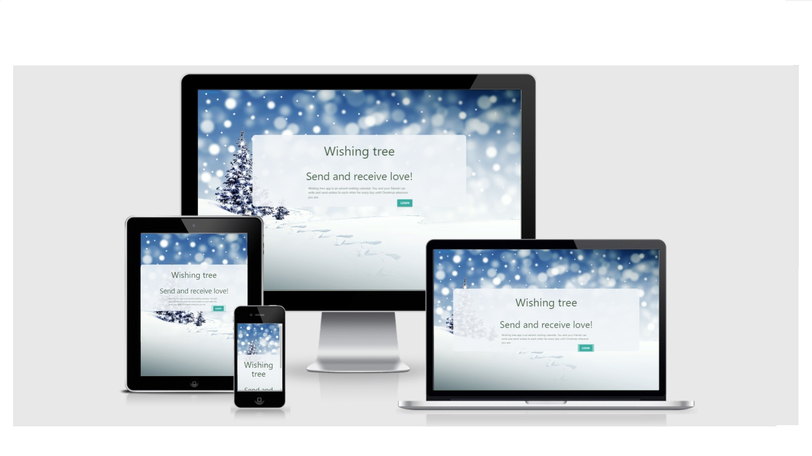
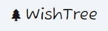
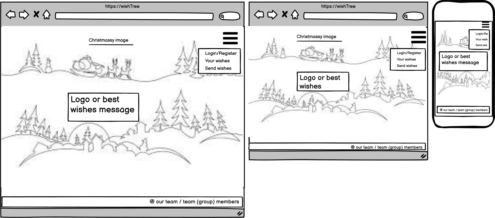
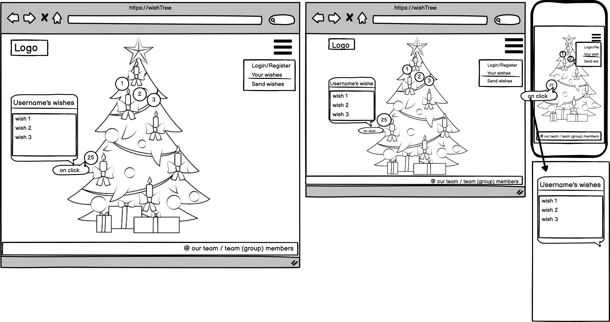
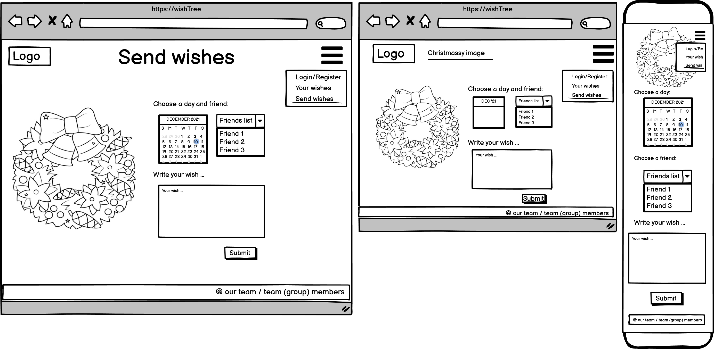
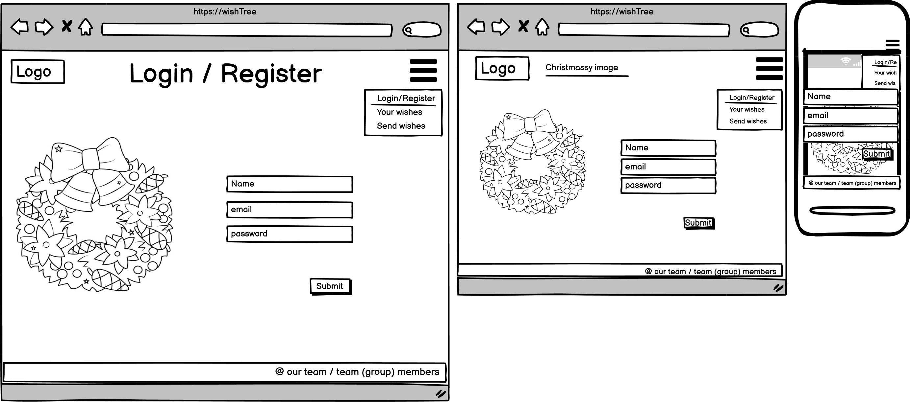

# [The WishingTree](https://snowflakes-ci-xmas-hackathon.herokuapp.com/)

This app was developed by 5 coders, the snowflakes, as part of the Code Institute Christmas 2021 Hackathon:  [Marina](https://github.com/marina601), [Anthony](https://github.com/auxfuse), [Chris](https://github.com/ChrisT-CC), [Debbie](https://github.com/debbiect246) and [Ana Melissa](https://github.com/AnaMelisaGo).

We were able to develop an app around the theme of Christmas and after some discussion we decided to create an app for a user to be able to send good wishes over the Christmas period to family and friends..

## Table of Contents :
* [What does it do and what does it need to fulfill?](#what-does-it-do-and-what-does-it-need-to-fulfill)
* [Functionality of Project](#functionality-of-project)
* [User Experience](#user-experience)
    * [User Stories](#user-stories)
    * [Design](#design)
        * [1. Font](#1-font)
        * [2. Color Scheme](#2-color-scheme)
        * [3. Logo](#3-logo)
        * [4. Geometry](#4-geometry)
        * [5. Wireframing](#5-wireframing)
* [Technology Used](#technology-used)
* [Database](#database)
* [Features](#features)
    * [Future Features](#future-features)
* [Testing](#testing)
    * [Defensive Design](#defensive-design)
* [Deployment](#deployment)
* [Credits](#credits)
    * [Special Thanks & Acknowledgements](#special-thanks--acknowledgements)

***

## Welcome to The Wishing Tree!

***

## What does the app do and what does it need to fulfill?
The Wishing Tree is an app that allows users create a profile and when logged in they can create  Christmas messages which are displayed to different family members or friends in their group.   A user sets up a group initially and adds friends and family members to the group so that these people can be easily selected when messages are created for them.

#### Our favicon

### Functionality of the Project
This application contains a login page, a register page, a wishing tree page, a logout page.
- User can login.
- User can register.
- User can create wishes which are displayed to family members and friends once they log in.
- User can logout of the app.

[Back to top](#table-of-contents)

## User Experience:

#### User Stories:
_Generic (Guest/Public) User:_
* As a Generic User, I want to see what this app does, how it works and to explore the site. The site should have a christmassy feel to it.

_Registers (Logged in) User:_
* As a Registered User, I want to:
    -  Assign myself to a group
    - See  all the wishes I have made in my profile
    - Create wishes to be displayed to a family member or friend
    

_Developer:_
* As a Developer, I want to
    - Create an app that is visually attractive to users.
    - Has a Christmassy feel to it.
    - Is easy for the user to use.

#### Design

##### 1. Font
[google fuzzy bubbles font ](https://fonts.googleapis.com/css2?family=Fuzzy+Bubbles&display=swap)was used for all pages in the project.

##### 2. Color Scheme

Colour palettes from [coolors.co ](https://coolors.co/344d2f-a81817-c8beb9-fac57d-f0f4f7) were used to make pages attactive to look at.

The colors used throughout used were based on green, red and white.

##### 3. Logo
The logo was created by Anthony and discussed and reviewed by team members. 

##### 4. Geometry

The applications geometrical aspects were chosen to place important images in the fore ground and other softened images in the background.  We decided to place our Christmas tree image on the left hand side of the page so that the readers eye was drawn to this first, with the aim being to emphasise the Christmas theme.  Along the top and bottom of the screen we placed some tinsel to add a contrasting colour to the screen and to promote a Chrismassy feel in the user!

The box inviting users to log in or register was placed in the bottom centre of the screen so that users could log in.  This box was designed to contrast with the screen so that it was easier to see.

Modals were placed in the middle of the screen once the user had completed an action.

##### 5. Wireframing

The wireframes were created for each individual page on three different screen sizes. They live below. 

##### Home page

Wish tree page

Send wishes page

Login/Register page

[Back to Top](#table-of-contents)

## Technology Used

#### Languages, Frameworks, Editors & Version Control:

#### Tech stack used

* We used the [Flask](https://flask.palletsprojects.com/) framework for handling REST API calls

* We used[materialize ](https://materializecss.com/getting-started.htm) for responsiveness.
  
* generating web pages from HTML templates with [Jinja](https://jinja.palletsprojects.com/) 

* [python ](https://www.python.org/)is a programming language widely used on the internet with web frameworks to create apps.

* [html ](https://devdocs.io/html/)stands for HyperText MarkUp Language and is used to put content and structure on a web page.

* [CSS](https://devdocs.io/css/) stands for cascading style sheets and is used to style a webpage.

* [Javascript ](https://www.w3schools.com/js/DEFAULT.asp)is used to implement interactivity on the site.
  
#### Version control

* version control was managed using github
    - Each person in the project used a branch to develop the chosen functionality.
    - Cards were raised in the project for each piece of functionality.
    - Issues were raised and could be commented on by all involved in the project.
    - As each piece of functionality was finished it was tested then pushed to the main github repo and then a pull request was issued.  The pull request was reviewed and approved by another collaborator before being merged into the main branch of the repo.

#### Structure of the app
- The app was built using a [mobile first paradigm ](https://www.biznessapps.com/blog/mobile-first-approach/).  

- The `app.py` file contains code related to Flask only, no database or form reference can appear in there.
- database files are stored in the `env.py` file which is in the `.gitignore` file.  The `.gitignore`file is not pushed to github as it contains data which is essential to running the app.

- the details in the `env.py` file were:

        import os
        os.environ.setdefault("IP", "0.0.0.0")
        os.environ.setdefault("PORT", "5000")
        os.environ.setdefault("SECRET_KEY", "xxxxxx")
        os.environ.setdefault("MONGO_URI", "mongodb+srv://xxx1@myxxxcluster.xxx.mongodb.net/xxxxx?retryWrites=true&w=majority")
        os.environ.setdefault("MONGO_DBNAME", "xxxx")

  - the `base.html` file contains the base HTML structure of all web pages generated in the app
  - the `home.html` is the welcome page and is the first page the user sees.
  - the `login.html` file contains template for a user to login to the app.
  - the `register.html` file contains the template for a user to register on the app.
  - form was created for user to make wish.
  - the `404.html` template was created with an appropriate christmas message should any page not display correctly, so that the user would see this page rather than the standard 404 page.
  - the `add_wish` page kept details of wishes users added and put these in the mongodb databse.
  - the `edit_wish.html` page was displayed and allowed users to edit wishes made previously.
  - the `wishing_tree.html` page enabled users to see wishes from people in their group which were specifically for them.
  - the `add_group.html` page enabled users to create a group that they were part of.  This data was then created in the mongodb database.
  - the static folder contained the css, javascript and images folders.
  - the css folder contained the `styles.css` file which was used for styling pages.  We also used CSS root variables for consistent styling across pages.
  - the image folder contained all images used in the app.  These have been credited below.
  - the js folder contained the `script.js` file which was used to implement interactivity on the site.

#### Tools Used:

* git hub was used to manage the project and we used issues, notification and issues to show important stages of the project and to comment on these.
* HTML and CSS were used to design pages for the app.
* The flask framework was used to set up and implement the app.
* javascript was used to implement interactivity.
* heroku was used to deploy the project.

## Database

#### Database Schema:

The databases were created in mongodb.
One database was created for users and passwords.
One database was created to hold details of users wishes.

* User database fields

    - user_name is the name of the user
    - user_password is the user's password
    - user_group is the group the user has allocated themselves to.
    - user_email is the users email.

* Wishes database fields

    - For_date  holds details of when the message should be seend by a user. 
    - Created_date  is the date the message was created by a user
    - username_from   is the name of the user who created the message
    - message is the field that contains the details of the message
    - for_name is the name of the user the message is intended for.

## Features

The project boasts several key features:
* It promotes friendship and love!
* It allows people in a group to be connected via messages input by users.
* It is easy to use.
* It allows registered users to see and review the messages they have sent over the Christmas period.

[Back to Top](#table-of-contents)

#### Future Features:

* Email can be sent by user to friend or family member telling them that a message is ready for them to view.

* User can access messages by day of the week it was sent.

## Testing

Testing was carried out manually initially.  As each person developed a feature they tested it.  This was then reviewed in group calls in slack where screens were shared and conversations took place about the code being created and the intended functionality.

Testing was also carried out using the following validators:

[ pep 8 python validator](http://pep8online.com/)

[css and html validator](https://validator.w3.org/)

[javascript validator](https://jshint.com/)

All validity tests were passed.

More about testing [here](TESTING.md)

#### Found Bugs and Fixes:

During manual testing some bugs were found in the following areas:
- responsiveness.  This was solved using css styling and [chrome developer tools.](https://developer.chrome.com/docs/devtools/open/)

We also found bugs in our `404.html` file and our `500.html` file.  These were corrected and tested manually.

[Back to Top](#table-of-contents)

#### Defensive Design

Defensive design for this application was...

## Deployment

[Heroku](https://www.heroku.com/) is a PaaS cloud service, you can deploy this project for free on it.

#### 7.6 Prerequisites:
- Marina forked  this project into her repository on GitHub.
- Heroku requires these files to deploy successfully, they are both in the root folder of the project:
- `requirements.txt`
- `Procfile`
- Marina already has a Heroku account.

#### 7.7 Create a Heroku App
Marina followed these steps to deploy the app from GitHub to Heroku:
- In Heroku, click on Create New App,  and give it a platform-unique name,  then choose region, click on `Create App` button
- On the app/Deployment page select GitHub as Deployment method, underneath click on `Connect GitHub` button
- In the GitHub authorization popup window login into GitHub with your GitHub username and click on `Authorize Heroku` button
- Type in your repo name and click `search`. It lists your repos. Choose the one and click on `connect` next to it.
- either enable automatic deployment on every push to the chosen branch or stick to manual deployment
- go to app/Settings page, click on `Reveal Config Vars` and enter the following variables and their values from the `envWS.py` file:
  * FLASK_SECRET_KEY
  * PORT
  * MONGO URI
  * MONGO DBNAME

[Back to Top](#table-of-contents)

## Credits

* Details of  credits

    - [Christmas tree - wish tree page](https://www.google.com/url?sa=i&url=https%3A%2F%2Fwww.pinterest.com%2Fpin%2F37119519[…]mages&cd=vfe&ved=2ahUKEwiLtqC8rdn0AhUnQEEAHelMB3wQjRx6BAgAEAk)

    - [Christmas wreath - send wishes and login/register page](http://www.supercoloring.com/paper-crafts/christmas-wreath-printable-template)

    - [home landscape - in home page is from some pinterest](https://www.google.com/url?sa=i&url=https%3A%2F%2Fwww.pinterest.com%2Fpin%2F37119519[…]mages&cd=vfe&ved=2ahUKEwiLtqC8rdn0AhUnQEEAHelMB3wQjRx6BAgAEAk)

    - [Home page Christmas tree landscape](https://pixabay.com/illustrations/christmas-winter-season-snow-3864552/)

    - [image for snowflakes on hackathon app](https://pixabay.com/users/geralt-9301/)

[Back to Top](#table-of-contents)

#### Special Thanks & Acknowledgements:

## Team & Hosts
* A huge thank you to all of our team members! Marina, Anna, Anthony, Chris and Debbie who  put a lot of hours into building this project over 4 days.
    - We created an issues board in the github repo where team members were able to raise and discuss issues with aspects of the code through regular calls and in the slack group.  Although initially aspects of the app were handled by individual team members, as the hackathon moved on we all worked together on those aspects to improve the user experience and functionality of the app.
    - Thanks so much to Code Institute  hosting this Christmas 2021 Hackathon.

###### <i>Disclaimer: This project was created for educational use only as part of Code Institute's 2021 Christmas Hackathon</i>

[Back to Top](#table-of-contents)